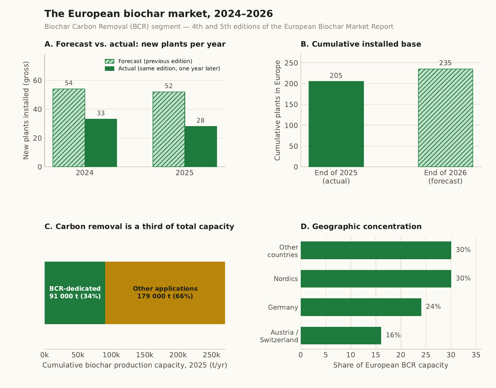
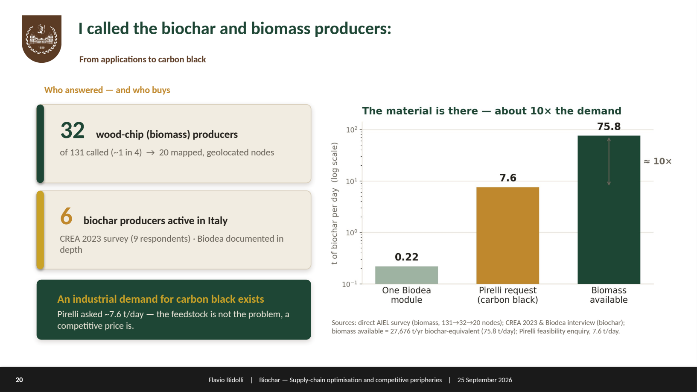
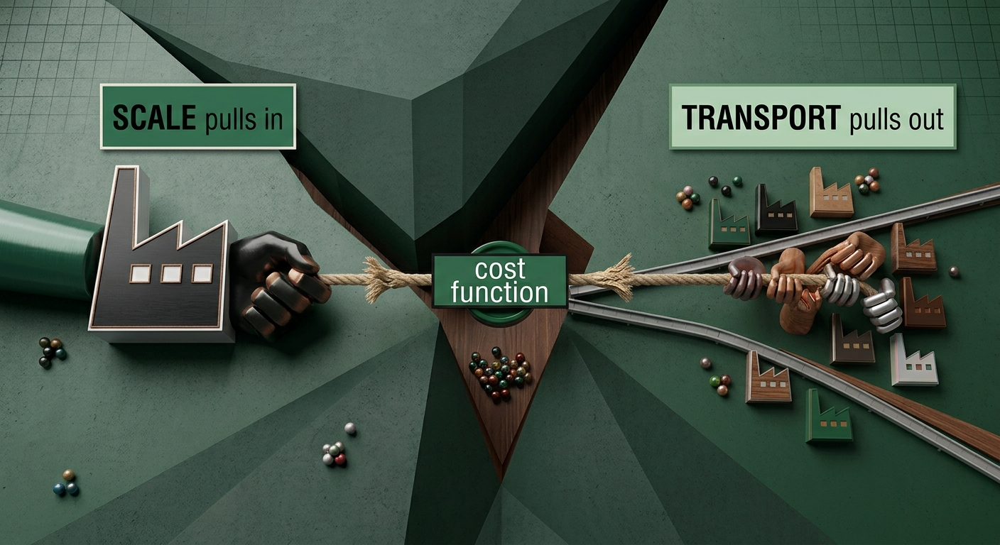
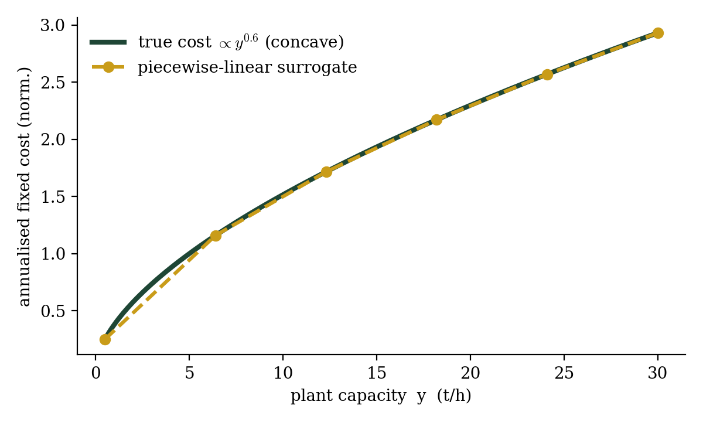
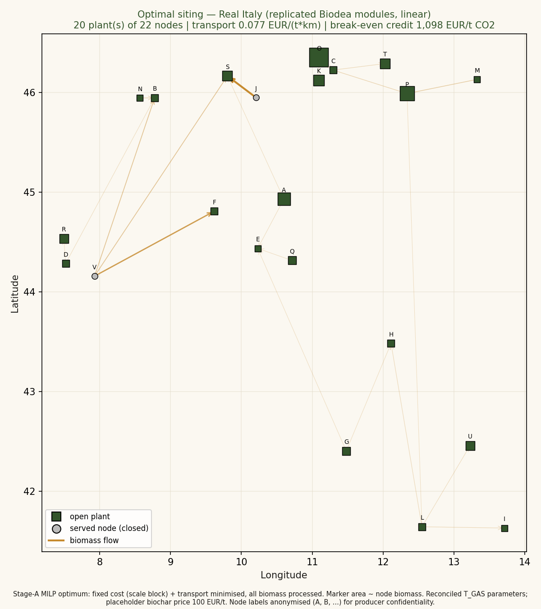
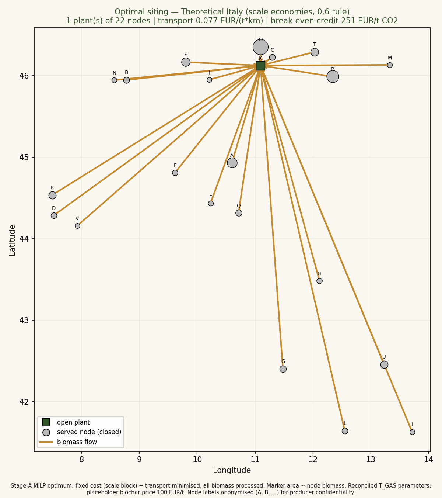
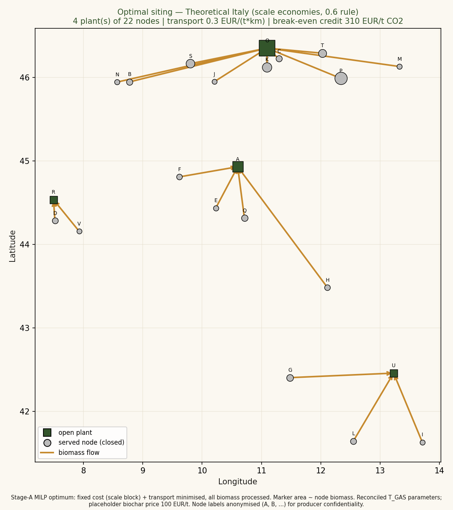
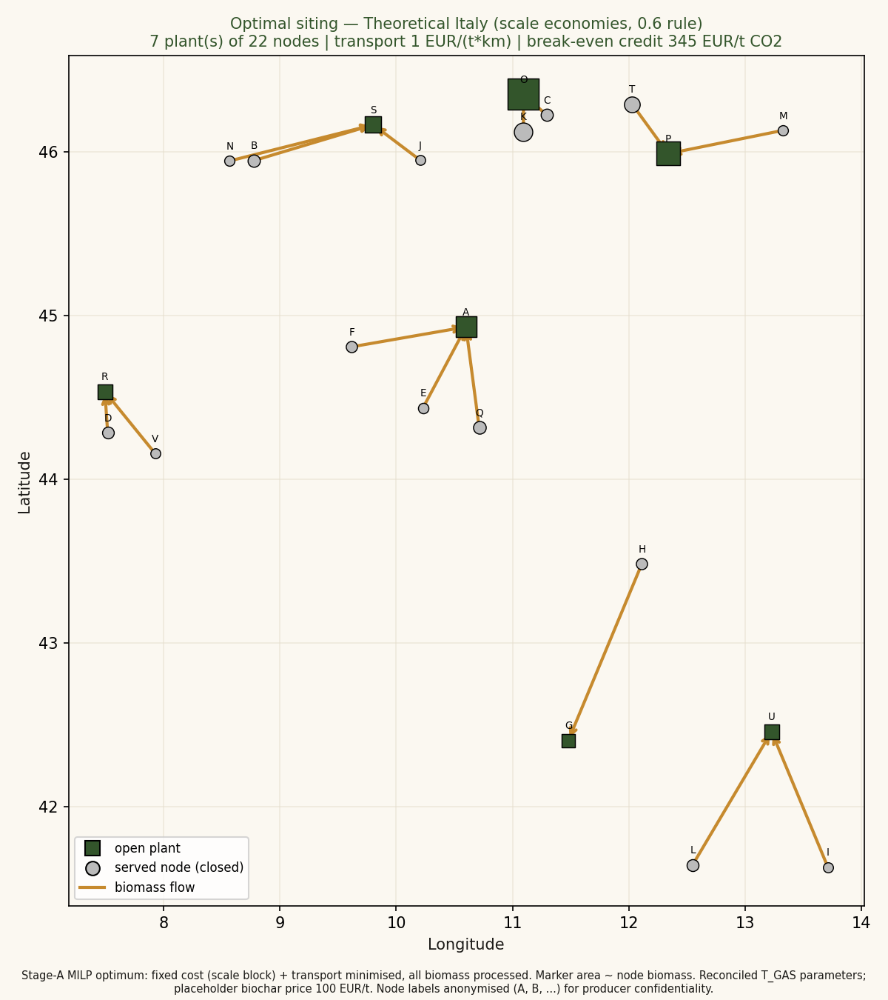
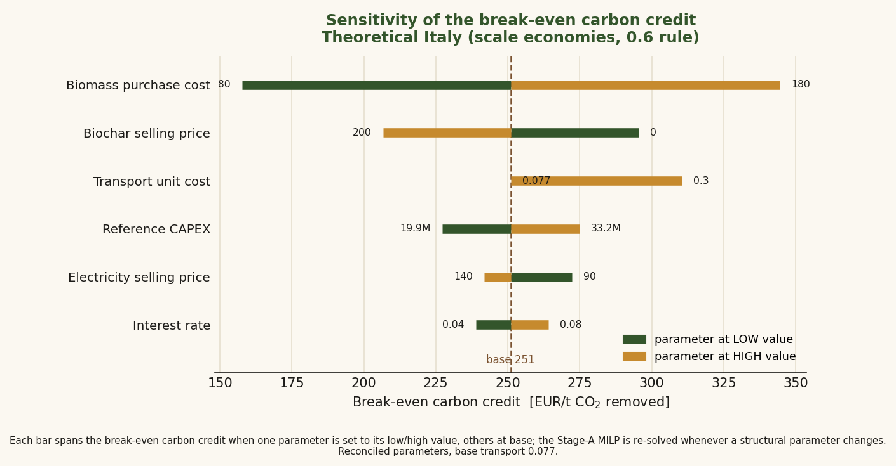
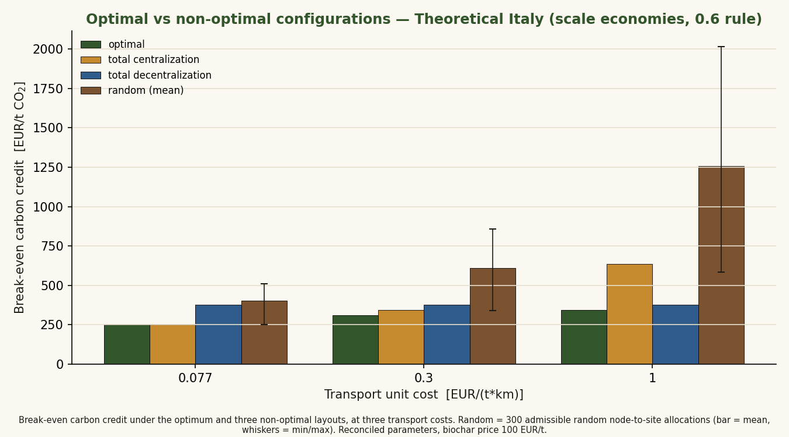

# A graph-based optimisation model for pricing an optimal carbon credit in the Northern-Italian biochar supply chain

**MSc thesis — Physics of Complex Systems, Politecnico di Torino (2026)**
Candidate: **Flavio Bidolli** · Advisors: **Prof. Mauro Giorcelli**, **Mattia Bartoli**

*A supply-chain optimisation model that asks a single question: at what price should a carbon credit be set so that an optimised Italian biochar supply chain can pay for itself while selling biochar at a price competitive with carbon black?*

> *"Formulating the right question is pure gold."*
> — Marc Mézard, *Where Mathematics Is Headed in the Age of AI* (15 September 2026)

This page is a narrated summary of the thesis. It follows the line of the final defence (28 September 2026): from a personal interest to a precise research question, through the collapse of the Italian data, to a model and its results. All figures are my own.

---

## 1. Why this question, and why from a physicist

I looked for a problem where the hard part was not solving an equation a machine could already solve, but *framing* it — deciding what to measure and building data that do not yet exist. Climate change is one such problem, and for Italy it is not abstract: by mid-century the country is expected to lose on the order of **6% of GDP** to global warming (Euro-Mediterranean Centre on Climate Change).

As team leader of **EcoPoli**, one of the Politecnico's student teams, I met biochar for the first time. Recalling that without carbon capture no serious fight against warming is possible, biochar stood out as a concrete ally: produced by **pyrolysis** — heating biomass in an oxygen-poor environment — waste biomass is turned into a stable, almost pure solid carbon that locks carbon away for a long time and has many industrial uses.

## 2. The data problem

I picked up the literature and entered the field, focusing on Italy. **Every figure in this section is my own, built from my own review of the market literature** — there was no ready-made dataset to draw on.

The European market grows — around 205 biochar plants cumulatively by end-2025, a larger base expected in 2026 — **but Italy never appears explicitly**, and the available market data lack transparency, scale, or territorial depth.

On the biomass side, the official Italian sources are worse: each is a top-down aggregate or a modelled potential, and none measures what is actually on the ground.

| Source | What it gives | Why it falls short |
|---|---|---|
| **ENEA — Biomass Atlas** | Potential of agro-industrial residues, national scale | **Never completed**, funding cut |
| **JRC — EU Biomass Flows** | Harmonised EU biomass production & trade, aggregated as fluxes | **Categories indiscernible**; no domestic-vs-import split |
| **S2Biom — Italy roadmap** | Technical potential 2030: 34.4 Mt/yr dry matter | A **modelled** 2030 projection, theoretical; not sited, not measured |
| **CRRA — Annex A** | Most recent national study; aggregates the above | **Internal inconsistencies** in the biochar data — which I found and flagged to the authors |

The consequence is that the usual tools of complex systems do not apply:

- **Financial / stochastic models** (as used for biofuels) are impossible: the time series simply do not exist.
- **Agent-based modelling** finds no well-defined agents: Italian producers barely interact, markets are highly localised, players are few and use near-identical technologies and business models.

## 3. From a vague interest to a precise question

Two things turned this into a workable question.

**The target came from the field, not from the desk.** Talking to the companies, I learned that the relevant competitor for biochar is **carbon black**: An **industrial demand** had appeared from **rubber industry** looking for biochar as a less-polluting substitute for carbon black in tyre production. That conversation, not the literature, is what fixed the economic benchmark — an existing industrial demand and a price to beat.

**The method came from one article.** Among a scattered literature, Grimm et al. (2026) was the lead:

> *"A candle of hope appears when I discovered Grimm's 2026 article: they study the European supply-chain market with an optimisation model for biochar produced from paper sludge; they had access to an important German company which disclosed to them their production and plant data, so they built a model to compute how to price a carbon credit — a financial tool to get money from the carbon dioxide subtracted from the atmosphere — in order to make the whole biochar-selling system break even, i.e. revenues equal costs."*

### Building the dataset — I picked up the phone

The data for Italy were just non-existent; so I called the wood-chip (biomass) producers and the biochar companies myself, one by one; even writing down their complains.

Out of **131 wood-chip producers** called, **32** gave usable numbers and became **geolocalised nodes**, reduced to the **22** that enter the model; of the few **biochar producers active in Italy**, Biodea is the one documented in detail. The available biomass is roughly **ten times** the demand implied by the carbon-black substitution: the bottleneck is not the resource.

### The research question
Putting everything together a single, precise, final research question could be asked:
> **At what price should a carbon credit be set so that an optimised Italian biochar supply chain covers its costs while selling biochar at a price competitive with carbon black?**

## 4. The model

**What it does.** The model takes as inputs the biomass nodes, the engineering specifications of the plants, the distances between nodes, the cost of building a new plant, and the transport cost of moving biomass. Subject to the condition that **every node must use all its feedstock** — processing it in its own plant or selling it to another node — it returns the **optimised geography** of the supply chain and the **capacity of each open plant**, then computes the carbon credit that makes costs and revenues break even.

**The tension at its core.** The whole problem is a single trade between two opposing pulls:

*Conceptual illustration of the model's tension, generated by the author with Google Gemini.*

- **Centralise** and exploit economies of scale — doubling a plant's capacity costs less than double;
- **Stay sparse** and save on transport cost — and therefore on emissions. Less transport means **more net CO₂ removed**.

### The break-even credit

The model is solved in two stages: **Stage A** is a location–allocation problem that fixes the layout by minimising fixed plus transport cost; **Stage B** takes that layout and computes its full economic and carbon balance, from which the single figure of merit is extracted — the **break-even carbon credit** $p^\star$, the credit price that exactly cancels the chain's deficit:

$$ p^\star \;=\; \frac{\text{full annual cost} \;-\; \text{annual revenues}}{\text{net CO}_2\text{ removed per year}} \;=\; \frac{\displaystyle K^{\mathrm{fix}} \;+\; K^{\mathrm{tr}} \;+\; K^{\mathrm{mat}} \;-\; Rv}{\mathrm{CO_2^{net}}} $$

The net CO₂ removed is computed through a **life-cycle assessment following the Puro.earth** methodology — the procedure actually used by the leading carbon-credit market. The full annual cost is the sum of three blocks — the fixed cost $K^{\mathrm{fix}}=\sum_j C_j$, the transport cost $K^{\mathrm{tr}}$ and the material cost $K^{\mathrm{mat}}$ — built and simplified below.

### The cost function, built and simplified

The general two-stage formulation of Grimm et al. was adapted to the Italian case by stripping away what Italy does not have, and keeping the model solvable. Each simplification is deliberate and stated.

**Fixed cost — the only nonlinear block, and the one that carries economies of scale.** With no detailed cost data, capital cost follows the engineering **six-tenths rule**; annualised through the capital recovery factor (CRF) and augmented by a fixed-OPEX fraction, the annual fixed cost of an open plant of capacity $y$ is

$$ F(y) \;=\; \bigl(\mathrm{CRF} + f_{\mathrm{OPEX}}\bigr)\, K_{\mathrm{ref}} \left(\frac{y}{y_{\mathrm{ref}}}\right)^{0.6}, \qquad \mathrm{CRF} = \frac{r\,(1+r)^{n}}{(1+r)^{n}-1} $$

so a plant $k$ times larger costs only $k^{0.6}$ times as much — the incentive to concentrate. Capacity is tied to the biomass actually routed to the plant, $\sum_i z_{ij} S_i \le y_j H$.

This block carries **two nonlinearities** that a linear solver cannot take: the concave $y^{0.6}$ curve, and the product $x_j y_j$ (the fixed cost must be charged *only* when the plant is open, $x_j=1$). Grimm handled these with a single straight-line approximation plus a McCormick envelope; reproduced here, it failed outside the capacity window $[y_{\min},y_{\max}]$, wrongly refusing to aggregate small plants. They were replaced by a **piecewise-linear (PWL) surrogate** accurate over the whole domain, with the open/closed switch folded into the interpolation weights:

$$ y_j = \sum_{k}\lambda_{jk}\,\hat y_k, \qquad C_j = \sum_{k}\lambda_{jk}\,\hat c_k, \qquad \sum_{k}\lambda_{jk} = x_j $$

The normalisation $\sum_k \lambda_{jk}=x_j$ does double duty: when $x_j=0$ every weight is zero, so $y_j=C_j=0$ and the bilinear product is never written; when $x_j=1$ the weights sum to one and land on the curve, while an adjacency (SOS2) condition keeps **at most two adjacent weights non-zero**, so a single segment is used.

**Material cost — the dominant term, and the one the optimiser cannot touch.**

$$ K^{\mathrm{mat}} \;=\; \sum_{i,j} z_{ij}\,S_i\,\pi_i \;+\; \rho_{\mathrm{res}}\,B\,g $$

Because every producer's biomass is fully allocated somewhere ($\sum_j z_{ij}=1$), the purchase term collapses to $\sum_i S_i \pi_i$ — **a constant, independent of the layout**. At base data it is ≈ **16.0 M€/yr**, larger on its own than the chain's total revenues. This is the structural reason the credit comes out high, and why spatial optimisation can only ever be a secondary lever.

**Transport cost — the counterweight to economies of scale.**

$$ K^{\mathrm{tr}} \;=\; \sum_{i,j} \tau\, d_{ij}\, S_i\, z_{ij} $$

with $d_{ij}$ the great-circle (haversine) distance and $\tau$ a flat tariff per tonne-kilometre. Concentrating the supply lowers the fixed cost but raises this term; the optimum balances the two.

**Simplifications made explicit.** Sub-product (upgrading) plants are dropped — Italy has none, so by-products are refined on site. A **single conversion technology** is kept, because only one is currently in use. The model is **static** (one annual period, no time index). Transport uses **straight-line distances** (the road detour is absorbed into $\tau$) and a **single flat tariff** (no load-, direction- or vehicle-dependence), and only inbound feedstock transport is counted. Feedstock is assumed to be of a single quality, so its price $\pi$ is uniform and only swept in the sensitivity analysis.

**Solver.** The assembled problem is a **mixed-integer linear program (MILP)**, solved by **branch-and-bound** through the **Pyomo** library.

| Symbol | Meaning |
|---|---|
| $R$ | scale exponent (six-tenths rule) |
| $K_{\mathrm{ref}},\,y_{\mathrm{ref}}$ | reference CAPEX and capacity |
| $r,\,n$ | discount rate, plant lifetime |
| $f_{\mathrm{OPEX}}$ | fixed OPEX, as a fraction of CAPEX |
| $H$ | effective operating hours per year |
| $n_{\mathrm{seg}}$ | number of PWL segments |
| $B$ | total biomass processed, $\sum_i S_i$ |
| $\tau$ | flat transport tariff (per tonne-kilometre) |

### The carbon side — the life-cycle balance (Puro.earth)

The denominator of $p^\star$ is the net CO₂ actually removed, drawn **following the Puro.earth methodology** — the procedure of the carbon-credit market the chain would sell into. The removal proper is the carbon locked in the biochar and expected to stay there over the hundred-year horizon used for carbon-removal accounting: of each tonne of biochar a fraction $\chi_C$ is carbon, of which a stable fraction $\chi_{\mathrm{stab}}$ survives (taken at **0.80**, the conservative end of the European Biochar Certificate range, so as not to over-credit), converted to CO₂ by the molar ratio $44/12$:

$$ \mathrm{CO_2^{seq}} \;=\; \rho_{\mathrm{bc}}\,B\,\chi_C\,\chi_{\mathrm{stab}}\,\frac{44}{12} $$

Against this are set the emissions the removal itself causes, grouped — as Puro.earth prescribes — into biomass supply, production and end-use:

$$ \mathrm{CO_2^{em}} \;=\; \underbrace{\mathrm{TK}\,e_{\mathrm{tr}}}_{\text{supply}} \;+\; \underbrace{B\,e_{\mathrm{pr}} + E\,e_{\mathrm{grid}} + K^{\mathrm{fix}}\,e_{\mathrm{cap}}}_{\text{production}} \;+\; \underbrace{\rho_{\mathrm{bc}}\,B\,\bigl(e_{\mathrm{use}} + \bar d\,e_{\mathrm{tr}}\bigr)}_{\text{end-use}} $$

$$ \mathrm{CO_2^{net}} \;=\; \mathrm{CO_2^{seq}} - \mathrm{CO_2^{em}} $$

where $\mathrm{TK}$ is the same tonne-kilometre aggregate that the transport cost is charged on (so a far-shipping layout is penalised twice, in euros and in CO₂), and the $e_\bullet$ are the emission factors of haulage, conversion, grid electricity, embodied capital and end-use.

Adopting this framework carries a substantive assumption, made explicit in the thesis: **the biochar sold is taken to be stable enough to count as a durable carbon removal under Puro.earth's procedures** — and it is precisely the permanence fraction $\chi_{\mathrm{stab}}$ that encodes it, kept conservative on purpose. At base data the sequestration is ≈ 68,000 tCO₂/yr and the supply emissions ≈ 2,700 t (the other terms zero at this stage), so the net removal is ≈ 65,300 tCO₂/yr — the emissions shave about 3.9% off the gross removal.

## 5. Results

**Validation.** A deliberately controllable, unrealistic scenario — identical small modules stacked in parallel, no economies of scale — behaves exactly as expected: cost grows linearly, and the arrows reveal non-obvious optima such as switched-off nodes and biomass hauled to saturate a module before opening a new one.

**Varying the transport tariff.** As transport gets dearer, the optimum breaks from a single central plant into several — the geography decentralises, and the break-even credit rises.

| Transport tariff τ | Open plants | Break-even credit |
|---|---|---|
| 0.077 €/(t·km) | 1 | **251 €/tCO₂** |
| 0.3 €/(t·km) | 4 | 310 €/tCO₂ |
| 1 €/(t·km) | 7 | 345 €/tCO₂ |

**Sensitivity — the sobering part.** A tornado analysis shows the output is dominated by the **biomass purchase price**: it swamps every other parameter, which makes the spatial optimisation, though it works as intended, **weak relative to it**.

**Does the optimisation matter?** Against extreme and random configurations, yes: where economies of scale can be exploited, the optimised chain (green) reaches a credit far below a random layout — **for fixed parameter values**, the optimisation earns its place.

**Headline.** Under highly conservative assumptions, a carbon credit in the range of **251 – 1,108 €/tCO₂** (economies of scale exploited vs. not exploited) lets biochar reach a selling price (~0.12 €/kg) competitive with carbon black at the volumes the market would require.

## 6. Conclusion

What blocks biochar in Italy is **not the resource** — the biomass is there, about ten times over. The binding constraints are **bureaucratic, logistical and administrative coordination**, and a credit price that today only a favourable configuration of parameters can reach. The spatial optimisation is a real but secondary lever next to the biomass price.

Looking back, the work was Mézard's rule put into practice: choose a real-world problem, formulate a precise question, build the data that did not exist, tie the model to reality, and judge honestly how much it actually buys.

---

## Beyond the thesis — EcoPoli

This research began inside **EcoPoli**, a student team at the Politecnico di Torino working on environmental projects and outreach, which I have led. It is where I first met biochar.
Instagram: [@eco_poli](https://www.instagram.com/eco_poli/)

## Acknowledgements

I thank my advisors **Mattia Bartoli** and **Mauro Giorcelli** for the opportunity of this work; the **CREA** association, in particular **Irene Criscuoli**, **Valentina Lasorella** and **Prof. David Chiaramonti**, for their time and advice; **Silvia Scozzafaglia** for her contribution on the carbon-credit component; and **Kiana Niazmand**, co-author of the reference article, for answering my questions about it. Thanks to the wood-chip producers who took part in the interviews, and to the companies that collaborated — **Biodea, AIEL, NeraBiochar, Moonlight Biochar, McMillan Agrotech, Evergreen Resources, Comim** — with a special thanks to **Francesco Barbagli** (Biodea).

---

## The optimisation model (code)

The model described above is included, as a small, self-contained and runnable
program, in the [`model/`](model/) folder. It represents the supply chain as a
**graph** of producer nodes and solves the two-stage **optimisation model** —
Stage A (a mixed-integer linear program that sites the plants and routes the
chips) and Stage B (the life-cycle balance that yields the break-even carbon
credit). It runs on the thesis's real geography, **anonymised and
privacy-perturbed**, so it reproduces the behaviour of the real study without
exposing any producer. See [`model/README.md`](model/README.md) for how to run
it and which parameters to vary.

---

### About this repository

This is a narrated summary of the MSc thesis, following the narrative of the final defence. Figures are the author's own; third-party material (reference papers, stock imagery) is cited, not reproduced. Node-level survey data obtained in confidence are not published; only the author's aggregated figures appear here.

*License: to be defined.*
