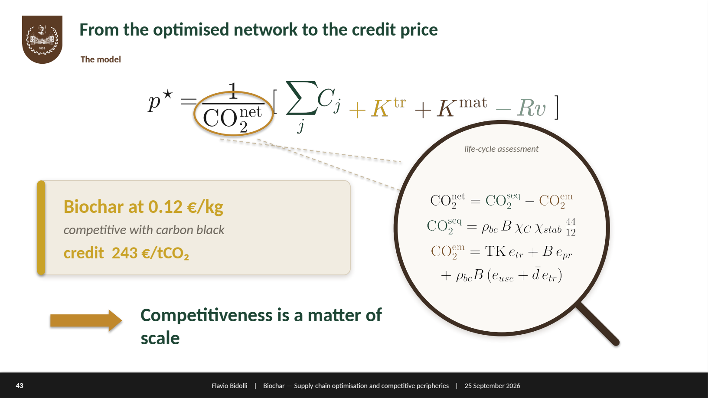

# Pricing an optimal carbon credit for a competitive Italian biochar supply chain

**MSc thesis — Physics of Complex Systems, Politecnico di Torino (2026)**
Candidate: **Flavio Bidolli** · Advisors: **Prof. Mauro Giorcelli**, **Mattia Bartoli**

*A supply-chain optimisation model that asks a single question: at what price should a carbon credit be set so that an optimised Italian biochar supply chain can pay for itself while selling biochar at a price competitive with carbon black?*

> *"Formulating the right question is pure gold."*
> — Marc Mézard, *Where Mathematics Is Headed in the Age of AI* (15 September 2026)

This page is a narrated summary of the thesis. It follows the line of the final defence (28 September 2026): from a personal interest to a precise research question, through the collapse of the Italian data, to a model and its results. All figures are my own.

---

## 1. Why this question, and why from a physicist

I looked for a problem where the hard part was not solving an equation a machine could already solve, but *framing* it — deciding what to measure and building data that do not yet exist. Climate change is one such problem, and for Italy it is not abstract: by mid-century the country is expected to lose on the order of **6% of GDP** to global warming (Euro-Mediterranean Centre on Climate Change).

As team leader of **EcoPoli**, one of the Politecnico's student teams, I met biochar for the first time. Recalling that without carbon capture no serious fight against warming is possible, biochar stood out as a concrete ally: produced by **pyrolysis** — heating biomass in an oxygen-poor environment — waste biomass is turned into a stable, almost pure solid carbon that locks carbon away for a long time and has many industrial uses.

## 2. The data problem

I picked up the literature and entered the field, focusing on Italy.

The European market grows — around 205 biochar plants cumulatively by end-2025, a larger base expected in 2026 — **but Italy never appears explicitly**, and the available market data lack transparency, scale, or territorial depth. The standard tools of complex systems did not help:

- **Financial / stochastic models** (as used for biofuels) are impossible: the time series simply do not exist.
- **Agent-based modelling** finds no well-defined agents: Italian producers barely interact, markets are highly localised, players are few and use near-identical technologies and business models.
- **Biomass data** are worse — scarce, outdated, incomplete or merely theoretical. The one national effort meant to anchor such studies, by **ENEA**, had its funding cut in 2019.

A lead appeared with **Grimm, Niazmand & Runge (2026)**, a two-stage supply-chain optimisation for biochar from paper sludge, built on production and plant data disclosed by a large German company. The approach was transferable to Italy — except that, in Italy, the data did not exist.

## 3. Building the dataset — I picked up the phone

So I built the dataset no registry would give me. I called the wood-chip (biomass) producers and the biochar companies myself, one by one.

Out of **131 wood-chip producers** called, **32** gave usable numbers and became **geolocalised nodes** of a graph of northern Italy; of the few **biochar producers active in Italy**, Biodea is the one documented in detail. One finding mattered beyond the numbers: **Pirelli** approached Biodea seeking biochar as a less-polluting substitute for carbon black — evidence that an **industrial demand** exists. The available biomass is roughly **ten times** the demand implied by that use: the bottleneck is not the resource.

## 4. The research question

> **At what price should a carbon credit be set so that an optimised Italian biochar supply chain covers its costs while selling biochar at a price competitive with carbon black?**

## 5. The model

**What it does.** The model takes as inputs the biomass nodes, the engineering specifications of the plants, the distances between nodes, the cost of building a new plant, and the transport cost of moving biomass. Subject to the condition that **every node must use all its feedstock** — processing it in its own plant or selling it to another node — it returns the **optimised geography** of the supply chain and the **capacity of each open plant**, then computes the carbon credit that makes costs and revenues break even.

**The tension at its core.** The whole problem is a single trade between two opposing pulls:

- **Centralise** and exploit economies of scale — doubling a plant's capacity costs less than double;
- **Stay sparse** and save on transport cost — and therefore on emissions. Less transport means **more net CO₂ removed**.

**The objective.** The break-even carbon credit is

$$ p^\star = \frac{1}{\mathrm{CO_2^{net}}}\left[\ \sum_j C_j \;+\; K^{\mathrm{tr}} \;+\; K^{\mathrm{mat}} \;-\; Rv\ \right] $$

minimised over the supply-chain layout, where the net CO₂ removed is computed through a **life-cycle assessment following the Puro.earth** methodology — the procedure actually used by the leading carbon-credit market.

### Cost function and the simplifications it took

The cost function has four blocks: **opening plants**, **transport**, **revenues**, and **biomass purchase**. Turning Grimm's general formulation into something that fits the Italian case — and stays solvable — required deliberate, stated simplifications:

- **Sub-product plants are dropped**: refining of by-products is treated as happening in the producing plant, not in new dedicated nodes.
- **A single conversion technology**, because at present only one is actually in use in Italy; technology choice is left to future work.
- **Static model**: one annual period, so the time index is removed.
- **Transport = flat tariff × distance**, with great-circle (haversine) distances, because the interviews were not precise enough to assign a specific cost to each link.

What remains is a fixed cost that is **concave in capacity** (the economy-of-scale "0.6 power" law) and must be charged **only when a plant is open**.

### The two nonlinearities, and how they are handled

The two nonlinearities are what make the problem interesting — and non-linear. Both are linearised so the problem becomes a MILP:

- **Economies of scale** ($\text{cost}\propto y^{0.6}$, so a plant twice as big costs only $\approx 2^{0.6}\approx 1.5\times$): the curve is sampled at breakpoints and each plant's cost and capacity are written as a weighted average of the two nearest breakpoints, with **at most two adjacent weights non-zero**.
- **The open/closed switch** (the fixed cost multiplies a binary "is the plant open?" variable): handled with a bilinear trick — the interpolation weights sum to **1 if the plant is open, 0 otherwise**.

The result is a **mixed-integer linear program (MILP)** solved by **branch-and-bound** through the **Pyomo** library.

## 6. Results

**Validation.** A deliberately controllable, unrealistic scenario — identical Biodea modules stacked in parallel, no economies of scale — behaves exactly as expected: cost grows linearly, and the arrows reveal non-obvious optima such as switched-off nodes and biomass hauled to saturate a module before opening a new one.

**Varying the transport tariff.** As transport gets dearer, the optimum breaks from a single central plant into several — the geography decentralises, and the break-even credit rises.

| Transport tariff τ | Open plants | Break-even credit |
|---|---|---|
| 0.077 €/(t·km) | 1 | **251 €/tCO₂** |
| 0.3 €/(t·km) | 4 | 310 €/tCO₂ |
| 1 €/(t·km) | 7 | 345 €/tCO₂ |

**Sensitivity — the sobering part.** A tornado analysis shows the output is dominated by the **biomass purchase price**: it swamps every other parameter, which makes the spatial optimisation, though it works as intended, **weak relative to it**.

**Does the optimisation matter?** Against extreme and random configurations, yes: where economies of scale can be exploited, the optimised chain (green) reaches a credit far below a random layout — **for fixed parameter values**, the optimisation earns its place.

**Headline.** Under highly conservative assumptions, a carbon credit in the range of **251 – 1,108 €/tCO₂** (economies of scale exploited vs. not exploited) lets biochar reach a selling price (~0.12 €/kg) competitive with carbon black at the volumes the market would require.

## 7. Conclusion

What blocks biochar in Italy is **not the resource** — the biomass is there, about ten times over. The binding constraints are **bureaucratic, logistical and administrative coordination**, and a credit price that today only a favourable configuration of parameters can reach. The spatial optimisation is a real but secondary lever next to the biomass price.

Looking back, the work was Mézard's rule put into practice: choose a real-world problem, formulate a precise question, build the data that did not exist, tie the model to reality, and judge honestly how much it actually buys.

---

## Beyond the thesis — EcoPoli

This research began inside **EcoPoli**, a student team at the Politecnico di Torino working on environmental projects and outreach, which I have led. It is where I first met biochar.
Instagram: [@eco_poli](https://www.instagram.com/eco_poli/)

## Acknowledgements

I thank my advisors **Mattia Bartoli** and **Mauro Giorcelli** for the opportunity of this work; the **CREA** association, in particular **Irene Criscuoli**, **Valentina Lasorella** and **Prof. David Chiaramonti**, for their time and advice; **Silvia Scozzafaglia** for her contribution on the carbon-credit component; and **Kiana Niazmand**, co-author of the reference article, for answering my questions about it. Thanks to the wood-chip producers who took part in the interviews, and to the companies that collaborated — **Biodea, AIEL, NeraBiochar, Moonlight Biochar, McMillan Agrotech, Evergreen Resources, Comim** — with a special thanks to **Francesco Barbagli** (Biodea).

---

### About this repository

This is a narrated summary of the MSc thesis, following the narrative of the final defence. Figures are the author's own; third-party material (reference papers, stock imagery) is cited, not reproduced. Node-level survey data obtained in confidence are not published; only the author's aggregated figures appear here.

*License: to be defined.*
